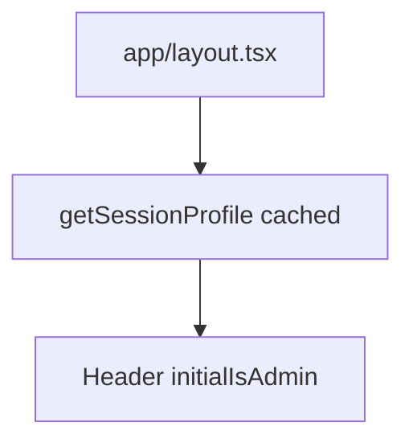

# Experidium — technical reference

Consolidated technical documentation for this repository. For product overview and onboarding prose, see [README.md](README.md).

---

## 1. Project identity

| Field | Value |
|--------|--------|
| **npm package name** | `experidium` |
| **Version** | `0.1.0` |
| **Visibility** | `private: true` |
| **Purpose** | Marketing and operations site: public marketing pages, Supabase auth, admin dashboard for newsletters/blog/subscribers |

---

## 2. Runtime and toolchain

| Item | Detail |
|------|--------|
| **Language** | TypeScript **5.x** (`strict: true`, `noEmit`, `moduleResolution: "bundler"`, `jsx: "react-jsx"`) |
| **Target** | `ES2017` |
| **Framework** | **Next.js 16.1.6** (App Router) |
| **Bundler (dev)** | **Webpack** — `npm run dev` runs `next dev --webpack` |
| **React** | **19.2.3** (`react` / `react-dom`) |
| **Package manager** | npm (lockfile: `package-lock.json`) |
| **Node** | Not pinned in-repo (no `.nvmrc`); use an LTS version compatible with Next 16 |

---

## 3. Dependencies (production)

| Package | Version (range) | Role |
|---------|-----------------|------|
| `next` | 16.1.6 | App framework, RSC, routing |
| `react` / `react-dom` | 19.2.3 | UI |
| `@supabase/ssr` | ^0.9.0 | Cookie-aware Supabase server/browser clients |
| `@supabase/supabase-js` | ^2.99.3 | Supabase client API |
| `@tiptap/react` | ^3.20.5 | Admin blog rich text |
| `@tiptap/starter-kit` | ^3.20.5 | TipTap extensions bundle |
| `@tiptap/extension-link` | ^3.20.5 | Links in editor |
| `@vercel/analytics` | ^2.0.1 | Web Analytics (root layout) |
| `@vercel/speed-insights` | ^2.0.0 | Speed Insights (root layout) |
| `embla-carousel-react` | ^8.6.0 | Carousels |
| `embla-carousel-autoplay` | ^8.6.0 | Carousel autoplay |
| `framer-motion` | ^12.35.0 | Motion / animations |
| `gray-matter` | ^4.0.3 | Frontmatter parsing (MDX pipeline) |
| `lucide-react` | ^0.577.0 | Icons |
| `next-mdx-remote` | ^6.0.0 | MDX rendering (blog fallback) |
| `resend` | ^6.9.4 | Transactional + newsletter email |
| `sanitize-html` | ^2.17.2 | HTML sanitization |
| `zod` | ^4.3.6 | Schema validation |

---

## 4. DevDependencies

| Package | Role |
|---------|------|
| `typescript` | Type checking |
| `eslint` + `eslint-config-next` | Linting (aligned with Next 16.1.6) |
| `tailwindcss` + `@tailwindcss/postcss` | Tailwind **v4** |
| `@tailwindcss/typography` | Prose styling |
| `sharp` | Image optimization (Next image pipeline) |
| `tsx` | Run TypeScript scripts (`scripts/`) |
| `dotenv` | Env loading in scripts |
| `@types/*` | Node / React typings |

---

## 5. Scripts (`package.json`)

| Script | Command |
|--------|---------|
| `dev` | `next dev --webpack` |
| `build` | `next build` |
| `start` | `next start` |
| `lint` | `eslint` |
| `seed:blog` | `tsx scripts/seed-blog-from-mdx.ts` |
| `verify:supabase` | `tsx scripts/verify-supabase-profiles.ts` |

---

## 6. TypeScript and path aliases

- **Alias:** `@/*` → project root ([tsconfig.json](tsconfig.json))
- **Next plugin:** `next` TypeScript plugin enabled

---

## 7. Next.js configuration

**File:** [next.config.ts](next.config.ts)

- **`images.remotePatterns`** (HTTPS):
  - `images.unsplash.com`
  - `lh3.googleusercontent.com` (path `/**`)
  - `**.supabase.co` — storage public objects: `/storage/v1/object/public/**`

---

## 8. Styling and design tokens

- **Tailwind CSS v4** with PostCSS ([postcss.config.mjs](postcss.config.mjs))
- **Global theme:** [app/globals.css](app/globals.css) — `@theme inline`, semantic colors (`background`, `foreground`, `primary`, `surface`, `muted`, `border`, …)
- **Fonts (next/font):** Instrument Sans (headings), Inter (body) — [app/layout.tsx](app/layout.tsx)

---

## 9. Application architecture

### 9.1 Routing (App Router)

- **Layouts:** Root [app/layout.tsx](app/layout.tsx) wraps all pages with `Header`, `main`, `Footer`, optional Vercel `Analytics` + `SpeedInsights` (skippable via env), optional Umami `Script`
- **Auth-gated admin:** [app/create/newsletter/layout.tsx](app/create/newsletter/layout.tsx) — admin role only
- **Dashboard shell:** [app/dashboard/layout.tsx](app/dashboard/layout.tsx) — redirects non-admins; allows `/dashboard/analytics` hub for admins (uses `x-pathname` from middleware)

### 9.2 Middleware

**File:** [middleware.ts](middleware.ts)

- Sets response header **`x-pathname`** for downstream layouts
- **Supabase:** `createServerClient` with request/response cookie bridging
- **Auth check:** `supabase.auth.getSession()` (not `getUser`) for `/create/newsletter` to avoid token-lock contention with RSC
- **Matcher:** All routes except `_next/static`, `_next/image`, `favicon.ico`, common static image/video extensions

### 9.3 Session and profiles

- **Server session helper:** [lib/auth/session.ts](lib/auth/session.ts) — `getSessionProfile` (wrapped in React `cache()` for per-request dedupe), `requireSessionProfile`, profile healing paths, optional service-role upsert
- **Supabase server client:** [lib/supabase/server.ts](lib/supabase/server.ts) — `cookies()` from `next/headers`
- **Admin client:** [lib/supabase/admin.ts](lib/supabase/admin.ts) — service role when configured

### 9.4 Root layout data flow

---

## 10. Integrations

| System | Usage in codebase |
|--------|-------------------|
| **Supabase** | Auth (email/OAuth), `profiles`, subscribers, newsletter tables, `blog_posts`, storage bucket `blog-media`, RPC `ensure_my_profile` |
| **Resend** | Subscribe welcome, contact/assessment, newsletter sends, admin notifications ([lib/resend.ts](lib/resend.ts), [lib/email/](lib/email/)) |
| **Brevo** | Optional subscriber mirror + stats API ([lib/brevo.ts](lib/brevo.ts), [app/api/newsletter/brevo-stats/route.ts](app/api/newsletter/brevo-stats/route.ts)) |
| **Vercel Web Analytics / Speed Insights** | `@vercel/analytics/react`, `@vercel/speed-insights/next` in root layout (omit when `NEXT_PUBLIC_VERCEL_*_DISABLED` is truthy) |
| **Umami** | Optional self-hosted analytics: `next/script` in root layout; shared dashboard iframe on [`/dashboard/analytics`](app/dashboard/analytics/page.tsx) |
| **Vercel (hosting)** | Typical deploy target; optional env URLs for outbound analytics links |

---

## 11. Environment variables

Define secrets in **`.env.local`** (local) and in the host (e.g. Vercel project settings) for production.

| Variable | Scope | Purpose |
|----------|--------|---------|
| `NEXT_PUBLIC_SUPABASE_URL` | Public | Supabase project URL |
| `NEXT_PUBLIC_SUPABASE_ANON_KEY` | Public | Anon key for browser + cookie sessions |
| `SUPABASE_SERVICE_ROLE_KEY` | Server only | Admin client, seeds, cron, privileged fixes |
| `NEXT_PUBLIC_SITE_URL` | Public | Canonical site origin (OAuth redirects, links) |
| `NEXT_PUBLIC_VERCEL_ANALYTICS_URL` | Public | Optional deep link to Vercel Web Analytics UI ([app/dashboard/analytics/page.tsx](app/dashboard/analytics/page.tsx), [UserMenu](components/layout/UserMenu.tsx)) |
| `NEXT_PUBLIC_VERCEL_PROJECT_URL` | Public | Optional Vercel project overview URL |
| `NEXT_PUBLIC_VERCEL_SPEED_INSIGHTS_URL` | Public | Optional Speed Insights URL |
| `NEXT_PUBLIC_UMAMI_SCRIPT_URL` | Public | Umami collector `script.js` URL |
| `NEXT_PUBLIC_UMAMI_WEBSITE_ID` | Public | Umami site ID (required with script URL for tracking) |
| `NEXT_PUBLIC_UMAMI_SHARE_URL` | Public | Umami public share URL for admin iframe |
| `NEXT_PUBLIC_VERCEL_ANALYTICS_DISABLED` | Public | When `1` / `true` / `yes`, root layout omits `<Analytics />` |
| `NEXT_PUBLIC_VERCEL_SPEED_INSIGHTS_DISABLED` | Public | When `1` / `true` / `yes`, root layout omits `<SpeedInsights />` |
| `RESEND_API_KEY` | Server | Resend API |
| `RESEND_FROM_EMAIL` | Server | Transactional default from |
| `RESEND_NEWSLETTER_FROM` | Server | Newsletter from (fallback: `RESEND_FROM_EMAIL`) |
| `CONTACT_FORM_TO_EMAIL` | Server | Contact/assessment inbox |
| `BREVO_API_KEY` | Server | Brevo API (optional) |
| `BREVO_LIST_IDS` | Server | Brevo list IDs (optional) |
| `CRON_SECRET` | Server | Bearer for [dispatch-newsletter](app/api/cron/dispatch-newsletter/route.ts); unsubscribe signing fallback |
| `NEWSLETTER_UNSUBSCRIBE_SECRET` | Server | Optional dedicated HMAC secret for [unsubscribe](app/api/newsletter/unsubscribe/route.ts) |
| `ADMIN_ALERT_EMAIL` | Server | Internal alerts; contact form fallback |

---

## 12. HTTP routes (Route Handlers)

| Path | File |
|------|------|
| `GET` (cron) `/api/cron/dispatch-newsletter` | [app/api/cron/dispatch-newsletter/route.ts](app/api/cron/dispatch-newsletter/route.ts) |
| `/api/newsletter/brevo-stats` | [app/api/newsletter/brevo-stats/route.ts](app/api/newsletter/brevo-stats/route.ts) |
| `/api/newsletter/unsubscribe` | [app/api/newsletter/unsubscribe/route.ts](app/api/newsletter/unsubscribe/route.ts) |
| `POST` `/api/blog/upload-cover` | [app/api/blog/upload-cover/route.ts](app/api/blog/upload-cover/route.ts) |
| `/auth/callback` | [app/auth/callback/route.ts](app/auth/callback/route.ts) |
| `/auth/logout` | [app/auth/logout/route.ts](app/auth/logout/route.ts) |

---

## 13. Notable pages (selection)

| Route | Notes |
|-------|--------|
| `/` | Homepage ([app/page.tsx](app/page.tsx)) |
| `/about`, `/service-static`, `/contact`, `/privacy-policy` | Marketing |
| `/case-studies`, `/case-studies/[slug]` | Case studies |
| `/blog`, `/blog/[slug]` | Blog (Supabase + MDX fallback, [lib/blog.ts](lib/blog.ts)) |
| `/blog/writeblogs` | Legacy redirect |
| `/login`, `/signup` | Auth ([app/(auth)/](app/(auth)/)) |
| `/missing-profile` | Profile setup / error path |
| `/create/newsletter` | Admin dashboard (tabs: newsletter, blog, subscribers) |
| `/dashboard` | Redirect logic ([app/dashboard/page.tsx](app/dashboard/page.tsx)) |
| `/dashboard/analytics` | Admin-only analytics hub (optional Umami iframe + Vercel outbound links) |
| `/dashboard/settings`, `/dashboard/admin`, `/dashboard/newsletter/*` | Legacy or auxiliary dashboard paths |

---

## 14. Supabase (database and SQL)

- **SQL scripts:** [supabase/sql/](supabase/sql/) — migrations and one-offs (RBAC, profiles, newsletter, blog, RLS fixes)
- **Primary bootstrap:** `auth_rbac_newsletter.sql` (see README for order and optional follow-ups)
- **Storage:** `blog-media` for blog cover images (see `next.config.ts` remote patterns)

---

## 15. Server actions and lib (high level)

| Area | Location |
|------|----------|
| Newsletter subscribe | [app/actions/subscribe.ts](app/actions/subscribe.ts) |
| Newsletter dashboard / campaigns | [app/actions/newsletter-dashboard.ts](app/actions/newsletter-dashboard.ts) |
| Blog publish / admin | [app/actions/blog-publish.ts](app/actions/blog-publish.ts) |
| Contact assessment | [app/actions/contact-assessment.ts](app/actions/contact-assessment.ts) |
| Auth welcome | [app/actions/auth-welcome.ts](app/actions/auth-welcome.ts) |
| Newsletter application | [app/actions/newsletter-application.ts](app/actions/newsletter-application.ts) |
| Admin writers | [app/actions/admin-writers.ts](app/actions/admin-writers.ts) |
| Blog data layer | [lib/blog.ts](lib/blog.ts), [lib/mdx.ts](lib/mdx.ts) |
| Newsletter dispatch | [lib/newsletter/dispatch.ts](lib/newsletter/dispatch.ts) |
| Site copy | [data/site.ts](data/site.ts), [data/caseStudies.ts](data/caseStudies.ts) |
| Dashboard tab query helpers | [lib/dashboard-tabs.ts](lib/dashboard-tabs.ts) |
| Public env flags (`1` / `true` / `yes`) | [lib/env/public-flags.ts](lib/env/public-flags.ts) |

---

## 16. Content

- **MDX blog source / seed input:** [content/blog/](content/blog/) (`*.mdx`)
- **Public assets:** [public/](public/) — hero video/poster, logos, imagery

---

## 17. Deployment and operations

| Topic | Detail |
|-------|--------|
| **Vercel** | Standard Next.js deployment; set all server env vars in the project dashboard |
| **Cron** | [vercel.json](vercel.json) is currently minimal (`{}`). Scheduled newsletter dispatch requires an external or Vercel cron hitting `/api/cron/dispatch-newsletter` with `Authorization: Bearer <CRON_SECRET>`. See README for Hobby vs Pro limits |
| **Analytics in-app** | Optional Umami embed when `NEXT_PUBLIC_UMAMI_SHARE_URL` is set; Vercel Web Analytics remains on vercel.com unless disabled — link when `NEXT_PUBLIC_VERCEL_ANALYTICS_URL` is set |

---

## 18. Linting

- **Config:** [eslint.config.mjs](eslint.config.mjs) — Next.js + TypeScript aware setup (`eslint-config-next`)

---

## 19. Related documentation

- [README.md](README.md) — onboarding, Supabase steps, cron/resend notes, route tables, component notes

_Last updated to match repository state: Next 16.1.6, React 19.2.3, package.json dependencies as listed above._
